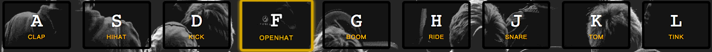

# 01 - JavaScript 鼓 工具包

## 示例


## 目录结构
``` bash
├── sounds/                      # 声音资源
│   └── ...
├── demo.gif                     # 示例图片
├── index.html                   # 排好版的页面
├── script.js                    # 写 JavaScript 的地方
└── style.css                    # 写 CSS 的地方
```

## 功能
1. 按下按钮对应的键盘按键(A|S|D|F|G|H|J|K|L)，**播放音乐**
2. 按下按钮对应的键盘按键(A|S|D|F|G|H|J|K|L)，高亮对应的 `class` 为 `playing` **按钮高亮显示**
3. 抬起按钮对应的键盘按键(A|S|D|F|G|H|J|K|L)， **高亮消失**
4. 抬起按钮对应的键盘按键(A|S|D|F|G|H|J|K|L)， **音乐停止**
5. 连续按某一键，**连续**高亮播放音乐

## 时间
1. 第一版建议用时 4  小时
2. 优化版建议用时 30 分钟
